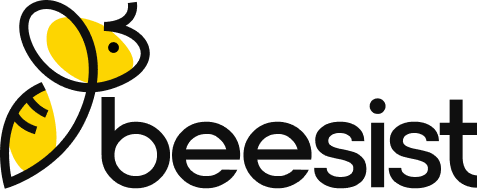

<p align="center">
  
</p>

# Beesist - Modular Property Management Platform

[](LICENSE.md)


**Beesist** is a state-of-the-art Property Management System (PMS) designed for landlords, property managers, and real estate agents. It provides a comprehensive suite of tools to manage properties, buildings, rental applications, and automated tenant communication through a scalable **Modular Monolith** architecture.

---

## 🌟 Key Features

### 🏢 Property & Building Management

- **Hierarchical Structure**: Manage multi-unit buildings and standalone properties.
- **Media Library**: Rich media management for property photos and documents.
- **Performance Reports**: Automated generation and delivery of property performance metrics to owners.

### 📝 Leasing & Rental Applications

- **Custom Form Builder**: Create tailored application forms and screening questions.
- **End-to-End Workflow**: Manage applicants from initial inquiry to signed lease.
- **Evaluation Tools**: Professional rental evaluation reports for prospective clients.

### 🤖 Automated Communication

- **Lead Engagement**: Automated email sequences for follow-ups and inquiries.
- **Showing Notifications**: Automated reminders and follow-ups for property showings.
- **Agreement Workflows**: Streamlined Property Management Agreement (PMA) and Tenancy Agreement flows with PDF generation.

### 🌐 Multi-Tenant Subdomain Portals

- Unique subdomain portals for managers (e.g., `manager-slug.forrentcentral.com`) to showcase listings and manage their portfolio.

---

## 🏗 Modular Architecture

The system is built using [nwidart/laravel-modules](https://nwidart.com/laravel-modules), ensuring a clean separation of business logic across domain boundaries.

| Module                | Responsibility                                                      |
| :-------------------- | :------------------------------------------------------------------ |
| **Property**          | Buildings, Units, Media, Showings, and Performance Reporting.       |
| **RentalApplication** | Leasing workflows, Screening questions, and Application processing. |
| **Leads**             | Lead tracking, PMA forms, and Rental evaluations.                   |
| **Tenant**            | Tenant account management and digital Tenancy Agreements.           |
| **FormBuilder**       | Core engine for creating dynamic forms and collecting submissions.  |
| **Cms**               | Management of static pages, announcements, and email templates.     |

---

## 👥 User Portals (RBAC)

Powered by [spatie/laravel-permission](https://spatie.be/docs/laravel-permission), the system provides dedicated experiences for:

- **👑 Admin**: Global oversight, module management, and system configuration.
- **🏢 Manager**: Portfolio management, team oversight, and high-level reporting.
- **🏠 Owner**: Direct view into property performance and financial summaries.
- **💼 Agent**: Focused toolset for showing properties and converting leads.

---

## 🛠 Tech Stack

- **Backend**: Laravel 11.x, PHP 8.2+
- **Database**: MySQL/PostgreSQL (Production), SQLite (Testing)
- **Frontend**: Livewire 3, Blade Components, Laravel Mix (Webpack)
- **Tables**: Rappasoft Laravel Livewire Tables
- **Payments**: Stripe (Laravel Cashier)
- **SMS/Voice**: Twilio Integration
- **Mailing**: SMTP with support for custom Email Templates and Markdown mailables.

---

## 🚀 Getting Started

### Prerequisites

- PHP 8.2+
- Composer 2.x
- Node.js & NPM
- MySQL/PostgreSQL

### Installation

1. **Clone the repository**

    ```bash
    git clone https://github.com/mradulsharma/beesist.git
    cd beesist
    ```

2. **Install dependencies**

    ```bash
    composer install
    npm install
    ```

3. **Configure Environment**

    ```bash
    cp .env.example .env
    php artisan key:generate
    ```

4. **Required Configurations**
   Update your `.env` file with the following:

    ```ini
    # Stripe Credentials
    STRIPE_KEY=your_public_key
    STRIPE_SECRET=your_secret_key

    # Twilio Credentials
    TWILIO_SID=your_sid
    TWILIO_TOKEN=your_token
    TWILIO_FROM=your_phone_number

    # Admin Email for Notifications
    ADMIN_EMAIL=admin@example.com
    ```

5. **Run Migrations & Seeding**

    ```bash
    php artisan migrate --seed
    ```

6. **Start Development Server**

    ```bash
    npm run dev
    php artisan serve
    ```

---

## 🧪 Testing

The project uses PHPUnit for feature and unit testing.

```bash
# Ensure pdo_sqlite is enabled in php.ini for testing
php artisan test
```

---

## 🤝 Contributing

We welcome contributions! Please see [CONTRIBUTING.md](CONTRIBUTING.md) for our development workflow.

## 📄 License

Beesist is open-sourced software licensed under the [MIT license](LICENSE.md).
